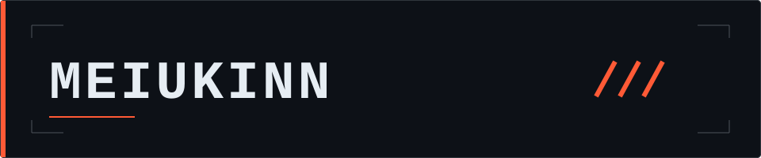

<div align="center">
  
  <h3>GAME DEVELOPER IN PROGRESS</h3>
  <p><code>BUILD • PLAY • ITERATE</code></p>
</div>

---

## PLAYER PROFILE

Computer Science student working toward game development, starting with **C#** and moving into **Unity**. I'm interested in gameplay programming, game systems, and interaction design, with game design as a longer-term direction.

My previous studies in Marketing shape my curiosity about player psychology, product design, and how people experience technology. HCI, computer vision, and interactive technology remain part of that curiosity.

## CURRENT QUEST

```text
NOW    / C# fundamentals
NEXT   / Unity gameplay
GOAL   / Systems & prototypes
LATER  / C++ and Unreal Engine
```

## FEATURED PROJECTS

Space reserved for upcoming game-development work. The entries below are **project placeholders**, to be replaced as projects take shape.

### 01 / Console RPG

**Concept** · C# · Combat system · Game logic

<!-- PROJECT 01
When a real repository is ready, turn the title above into a Markdown link.
Add a one-sentence description of what is implemented and your contribution.
Insert a screenshot or short gameplay GIF below that description:

Add a playable build link only if one exists.
-->

### 02 / Unity Gameplay Prototype

**Concept** · C# · Unity · Gameplay mechanics

<!-- PROJECT 02
Replace this title with the real project name and link to its repository.
Describe the mechanic, what is implemented, and your contribution.
Insert a screenshot or short gameplay GIF below that description:

Add a playable build link only if one exists.
-->

### 03 / Next Project

**Open slot** · Scope to be decided

<!-- PROJECT 03
Replace this placeholder with a real project title and repository link.
Add the actual tools used, a concise description, and your contribution.
Insert a screenshot or short gameplay GIF below that description:

Add a playable build link only if one exists.
-->

## GAME DEVELOPMENT

- **C#** — learning the fundamentals.
- **Unity** — next step for gameplay development.
- **C++ / Unreal Engine** — planned learning direction.
- **Git** — version control for the development workflow.

## OTHER TOOLS

[Python](https://www.python.org) · [OpenCV](https://opencv.org) · [Docker](https://www.docker.com) · [MySQL](https://www.mysql.com) · [HTML](https://developer.mozilla.org/en-US/docs/Web/HTML)

## FIND ME

Happy to connect over small game projects, interactive experiments, and learning together.

[Xiaohongshu](https://www.xiaohongshu.com/user/profile/5e4d023600000000010047dd) · [Personal website](https://www.meiukinn.com/) · [Gmail](mailto:meiukinn1024@gmail.com)

---

<div align="center">
  <p><sub>Build. Play. Iterate.</sub></p>
</div>
